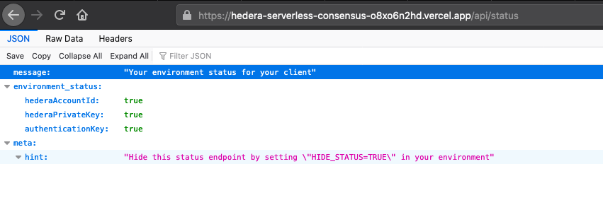

# Environment Variables

## Required 

As noted in the previous section these are the required environment variables required to successfully deploy.

* **HEDERA\_NETWORK**
* **HEDERA\_ACCOUNT\_ID**
* **HEDERA\_PRIVATE\_KEY**
* **API\_SECRET\_KEY**

The **HEDERA\_ENVIRONMENT** is case-insensitive but when lower cased it must map to either, **testnet**, **previewnet** or **mainnet**.


If there is an invalid value the client will automatically throw the error.

> _Network from environment 'x' could not match for any hedera network._ Change your 'HEDERA\_NETWORK' environment variable to either: "testnet', 'previewnet' or 'mainnet'

Your scheduled test suite will also expose this configuration issue.


The variables **HEDERA\_ACCOUNT\_ID** and **HEDERA\_PRIVATE\_KEY** can be found in your hedera account [after registration](https://portal.hedera.com/register). 

The **API\_SECRET\_KEY** is securely generated by you and it acts as your authentication key into your REST API.

## Optional Variables

These variables are completely optional and aren't required but they unlock additional capacity for validating an installation of a client, webhook functionality and security.

* **API\_URL**
* **WEBHOOK\_URL** 
* **HIDE\_STATUS**

The **API\_URL** variable is exclusively used by Github Actions to automatically check the status of a deployment, this isn't required to be part of the vercel deployment.

The **WEBHOOK\_URL** variable ****provides a method for all timestamped consensus responses to be sent to your server, allowing you to set up an asynchronous flow for broadcasting messages and not having to wait for consensus timestamps. 


Using an asynchronous consensus flow enables new messages to be broadcast to hedera via your client in the 150-200ms range instead of waiting for the full 3-5 seconds for response finality when processed linearly.


The **HIDE\_STATUS** variable provides the ability to hide the publicly available status screen that describes the state of your deployment, by default this status screen will be displayed.

