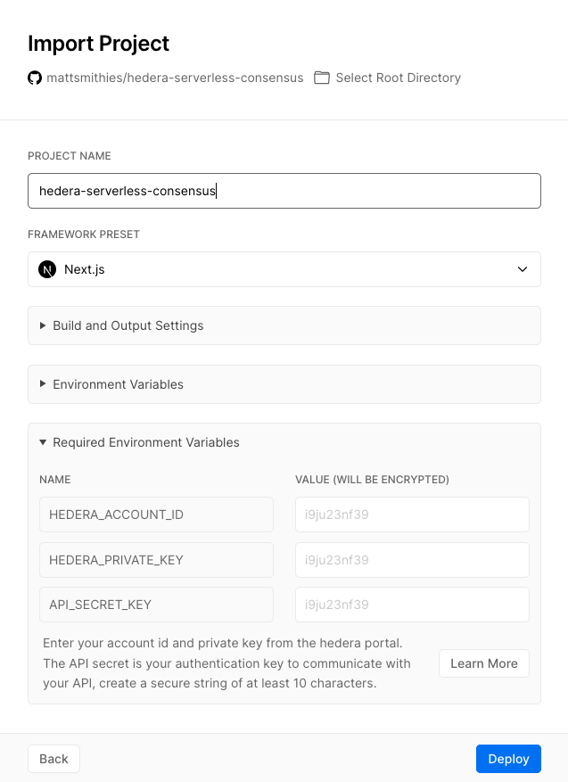

# Vercel

### Background 

The project is a NextJS app, with a custom REST API framework to allow for flexible testing. It is effectively a wrapper for the NodeJS SDK focused on consensus and trust.

### Start the deployment with Vercel

You can start the deployment by [clicking this link](https://vercel.com/import/git?s=https://github.com/mattsmithies/hedera-serverless-consensus&env=HEDERA_NETWORK,HEDERA_ACCOUNT_ID,HEDERA_PRIVATE_KEY,API_SECRET_KEY&envDescription=Enter%20your%20account%20id%20and%20private%20key%20from%20the%20hedera%20portal.%20The%20API%20secret%20is%20your%20authentication%20key%20to%20communicate%20with%20your%20API,%20create%20a%20secure%20string%20of%20at%20least%2010%20characters.&envLink=https%3A%2F%2Fdocs.trust.enterprises%2Fdeployment%2Fenvironment-variables&redirect-url=https%3A%2F%2Fdocs.trust.enterprises%2Frest-api%2Foverview), this will redirect you to vercel and use the github project as a template it will also inject the various required environment variables in order to successfully deploy.

### Requirements

In order to successfully deploy the application you need to add 3 environment variables. These variables **HEDERA\_ACCOUNT\_ID** and **HEDERA\_PRIVATE\_KEY** can be found in your hedera account [after registration](https://portal.hedera.com/register). 

The **HEDERA\_NETWORK** describes the network you are targeting you can select **mainnet**, **previewnet** or **testnet**.

The **API\_SECRET\_KEY** is what you generate to interact with your REST client, keep this secret private and only share it with individuals that need to interact with it, it needs to be act least 10 characters long. 

Consider generating it through a password manager like [1Password](https://1password.com) or [Lastpass](https://www.lastpass.com/). Alternatively you could use the [keychain access app in OSX ](https://en.wikipedia.org/wiki/Keychain_%28software%29)to generate a suitable password.

