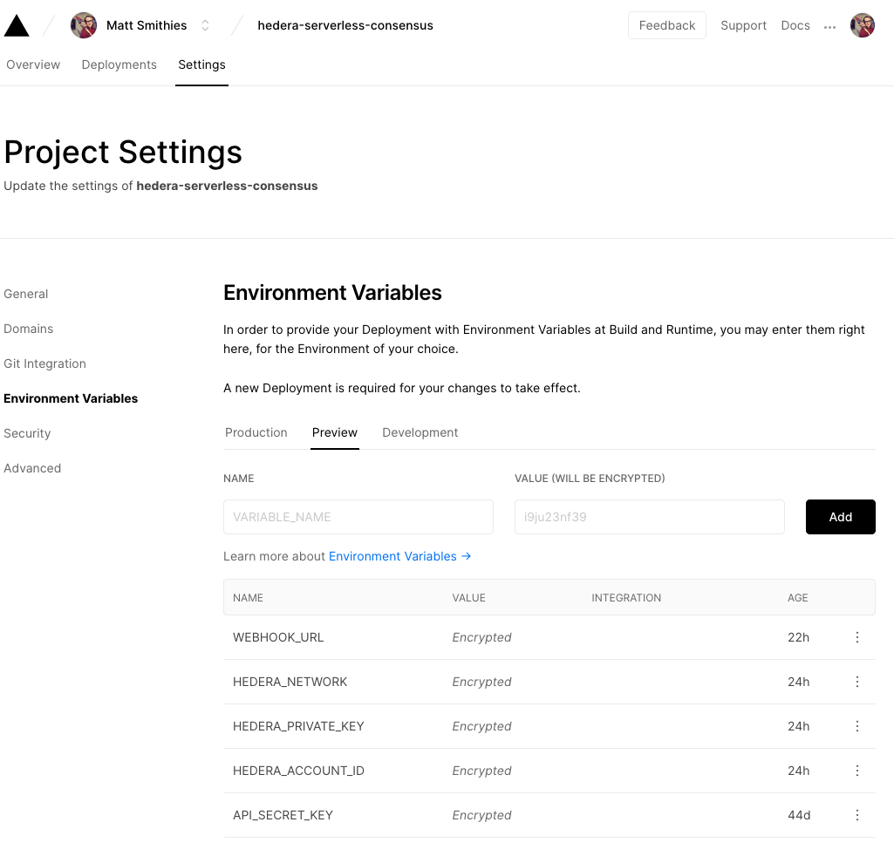

# Overview

[This Laravel package](https://github.com/trustenterprises/laravel-hashgraph) allows SaaS builders to integrate with distributed ledger technology, Hedera Hashgraph, at minimal effort and cost.

It is effectively **proof of anything** packaged up, for free, and with no overhead.

There are 2 methods to configure this package.

If you are just getting started with Trust Enterprises and you will use Laravel, [we recommend that you use this link](https://vercel.com/import/settings?s=https%3A%2F%2Fgithub.com%trustenterprises%2Fhedera-serverless-consensus&env=HEDERA_NETWORK%2CHEDERA_ACCOUNT_ID%2CHEDERA_PRIVATE_KEY%2CAPI_SECRET_KEY%2CWEBHOOK_URL&envDescription=Enter+your+account+id+and+private+key+from+the+hedera+portal.+The+API+secret+is+your+authentication+key+to+communicate+with+your+API%2C+create+a+secure+string+of+at+least+10+characters.&envLink=https%3A%2F%2Fdocs.trust.enterprises%2Fdeployment%2Fenvironment-variables&redirect-url=https%3A%2F%2Fdocs.trust.enterprises%2Frest-api%2Foverview&id=287751270&b=master&framework=nextjs), which includes the **WEBHOOK\_URL** configuration when initially creating your client.

Alternatively, adding the **WEBHOOK\_URL** as a new environment variable in your project settings. You will have to **redeploy your client for the changes to take effect.**

> If you are testing locally use ngrok or localhost.run to create a tunnel to your local app.

### A brief overview

A Laravel client library to automate adding webhooks, feeding the trust responses into your database automatically.

1. A fluent PHP API that communicates with the REST API.
2. Inbuilt database consensus table migrations that contain the bare bones of tables you need to have a stored log. 
3. The webhook flow will automatically store and validate all incoming consensus timestamp responses.
4. Custom events on insert events so that you may easily add additional logic if required.

## \*\*\*\*

